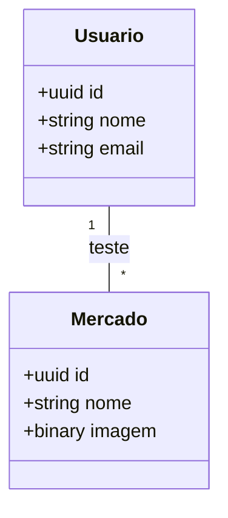

Diagrama de Classes em Mermaid.

```mermaid
classDiagram
	%% Diagrama em si
	class Usuario {
		+uuid id
		+string nome
		+string email
	}

	class Mercado {
        +uuid id
        +string nome
        +binary imagem
    }

	%% Relacionamentos
	Usuario "1" -- "*" Mercado : teste
```

